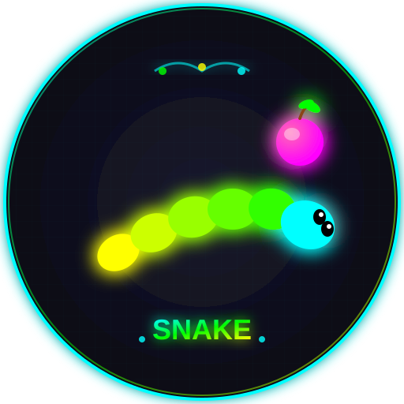

# 🎮 贪吃蛇小游戏

一个基于 Vue.js 和 uni-app 框架开发的经典贪吃蛇游戏，支持触屏操作，带有霓虹灯风格的视觉效果。

## ✨ 游戏特色

- **🎯 经典玩法**：控制贪吃蛇吃到食物，避开墙壁和自身
- **🕹️ 摇杆控制**：直观的虚拟摇杆，支持上下左右四个方向
- **🌈 霓虹风格**：精美的暗色主题配以青色霓虹灯效果
- **📱 移动端优化**：专为触屏设备设计的界面
- **🎨 渐变蛇身**：蛇身颜色从头部到尾部的渐变效果
- **📊 实时计分**：实时显示当前得分
- **🏆 最高记录**：挑战你的最高分

## 🚀 游戏规则

1. **控制方式**：使用屏幕底部的虚拟摇杆控制蛇的移动方向
2. **得分机制**：每吃到一颗食物 +10 分
3. **游戏结束条件**：
   - 撞到游戏边界墙壁
   - 撞到自己的身体
4. **重新开始**：游戏结束后点击"重新开始"按钮即可

## 🛠️ 技术栈

- **前端框架**：Vue.js 2.x
- **跨平台开发**：uni-app
- **样式语言**：SCSS / CSS3
- **动画技术**：CSS Animations
- **游戏循环**：requestAnimationFrame

## 📦 项目结构

```
snake_game/
├── pages/
│   └── index/
│       └── index.vue          # 主页面组件
├── static/
│   └── logo.png               # 游戏Logo
├── App.vue                    # 应用入口
├── main.js                    # 应用入口文件
├── manifest.json              # 应用配置文件
├── pages.json                 # 页面配置文件
└── README.md                  # 项目说明文件
```

## 🎨 UI 设计

### 配色方案
- **主色调**：青色 (#00FFFF)
- **辅助色**：绿色 (#00FF00)、黄色 (#FFFF00)
- **背景色**：深色 (#121212、#1E1E1E)
- **强调色**：品红 (#FF00FF)

### 视觉元素
- **霓虹发光**：按钮、蛇身、食物都有发光效果
- **渐变背景**：关于页面使用深蓝渐变
- **网格对齐**：游戏区域显示对齐网格
- **平滑动画**：摇杆移动、蛇身移动都有平滑动画

## ⚙️ 配置参数

| 参数 | 默认值 | 说明 |
|------|--------|------|
| gridSize | 20rpx | 网格大小 |
| boardWidth | 30 | 游戏板宽度（格子数） |
| boardHeight | 40 | 游戏板高度（格子数） |
| speed | 150ms | 移动速度（毫秒） |
| snakeLength | 3 | 初始蛇身长度 |

## 🚀 快速开始

### 环境要求
- Node.js 16+
- HBuilderX (推荐) 或 VS Code

### 安装依赖
```bash
# 使用 npm
npm install

# 使用 yarn
yarn install
```

### 运行项目
```bash
# 开发模式
npm run dev

# 构建项目
npm run build
```

### 在 HBuilderX 中运行
1. 打开 HBuilderX
2. 导入项目
3. 选择"运行到浏览器"或"运行到小程序模拟器"

## 📱 屏幕截图

### 游戏界面
- 清晰的蛇身和食物显示
- 实时分数更新
- 响应式摇杆控制

### 关于页面
- 渐变背景设计
- 详细游戏信息
- 精美的关闭动画

## 🎯 进阶功能

### 游戏优化
- **性能优化**：使用 requestAnimationFrame 实现流畅动画
- **防反向移动**：防止快速反向操作导致游戏意外结束
- **碰撞检测**：精确的边界和自身碰撞检测
- **食物生成**：确保食物不会生成在蛇身上

### 扩展建议
1. **音效系统**：添加吃到食物和游戏结束的音效
2. **关卡模式**：添加不同难度的关卡
3. **排行榜**：添加本地或在线排行榜
4. **道具系统**：添加特殊食物或道具
5. **主题切换**：添加多种主题风格

## 🤝 贡献指南

欢迎贡献代码！请遵循以下步骤：

1. Fork 本仓库
2. 创建特性分支 (`git checkout -b feature/AmazingFeature`)
3. 提交改动 (`git commit -m 'Add some AmazingFeature'`)
4. 推送到分支 (`git push origin feature/AmazingFeature`)
5. 创建 Pull Request

## 📄 开源协议

本项目基于 MIT 协议开源。

## 👨‍💻 作者

**Seaton**

- GitHub: [@Seaton](https://github.com/seatonyang/snake_game)
- Email: seaton.yang@foxmail.com

## 🙏 致谢

- 感谢 uni-app 团队提供的优秀跨平台框架
- 感谢 Vue.js 社区的丰富生态
- 感谢所有测试和反馈的用户

---

<p align="center">
  
</p>

<p align="center">
  🎮 Made with ❤️ by Seaton 🎮
</p>
